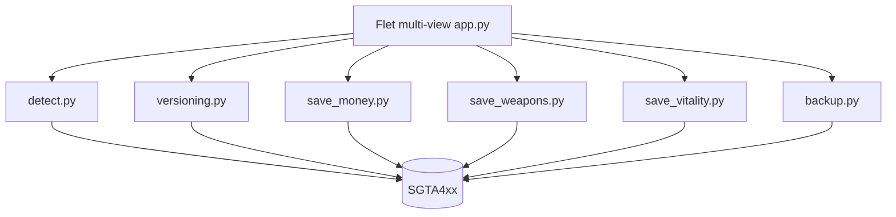

# App overview

Offline Windows PlayerInfo editor for GTA IV **Complete Edition** Profiles (`SGTA4xx`). UI: Flet 1.0. Supported savegame dword: **57** (CE and pre-CE End families). Dual-arch EXE via `flet pack`.



## Features

### Startup save gate

On every launch, pick a Rockstar Profile and `SGTA4xx` slot, then **Continue**. Last profile/slot are remembered in settings and pre-selected next time. **Change save** is available from the home menu and Settings (not repeated in each editor).

### Home menu

Outlined tiles switch views with fade animation. Window size snaps per view (user-non-resizable).

| View | Edits |
|------|--------|
| **Money** | Set / add cash |
| **Weapons** | Episode strip + 2×5 slot cards, picker, equipped slot |
| **Vitality** | Health, armour, max health, max armour |
| **Settings** | Autobackup, also-autosave, Change save |

Keyboard: Tab moves focus; Enter activates; Esc returns to menu; digits `1`-`4` open views from the menu.

### Edit flow

1. Quit GTA IV completely.
2. Open 4Bucks, Confirm/Continue on the save gate.
3. Open a view — status chip shows slot, mission title, version, and eligibility.
4. Apply edits (Autobackup on by default; optional also-autosave `SGTA412`).
5. Load the save in-game.

### Weapons loadout

Episode strip (**IV** / **TLAD** / **TBoGT** / **All** / **Mods**) filters the picker catalog only; the 10 PlayerInfo slots stay the same. Stock and episodic IDs are labeled **stock**; unknown IDs are **mod**. When a GTA IV install is found, `weaponinfo.xml` may resolve extra names.

### Autobackup

| Location | Pattern |
|----------|---------|
| Beside the save | `SGTA4xx.backup` |
| App folder | `backups/{profile}_{SGTA4xx}_{timestamp}_m{old}.backup` |

If either copy fails, the write is aborted.

### Safety gates

- Warns if `GTAIV.exe` is running.
- Version gate and PlayerInfo checks; technique `PLAYERINFO_INPLACE_V57` for dword 57 (CE and pre-CE End families).
- Dual Autobackup by default.

### Save locations (CE)

```text
%USERPROFILE%\OneDrive\Documents\Rockstar Games\GTA IV\Profiles\<ID>\
%USERPROFILE%\Documents\Rockstar Games\GTA IV\Profiles\<ID>\
```

| File | Meaning |
|------|---------|
| `SGTA400` | Manual slot 1 |
| `SGTA401`-`SGTA411` | Slots 2-12 |
| `SGTA412` | Autosave (IV) |
| `SGTA413` / `SGTA414` | TLAD / TBoGT autosave |

### CLI

```powershell
python -m src.save_money "PATH\TO\SGTA412" --read-only
python -m src.save_money "PATH\TO\SGTA412" --amount 500000
```
