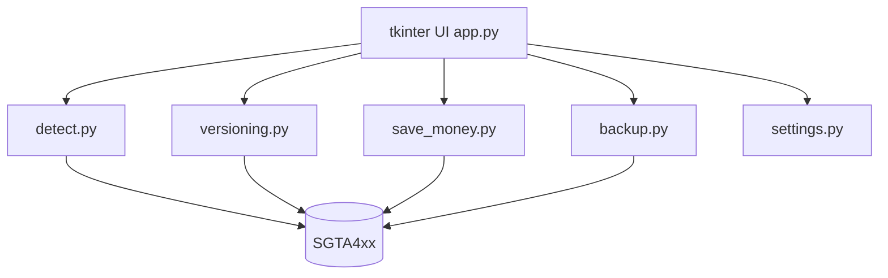

<a id="nav-app-overview"></a>

## 🏠 App overview

**Standing:** Offline Windows save editor for GTA IV **Complete Edition** Profiles (`SGTA4xx`). App SemVer **v1.1.0** · supported savegame version **57** · dual-arch EXE (x64 / x86).



<a id="nav-features"></a>

## ✨ Features

### Edit cash safely

1. Quit GTA IV completely.
2. Open **Save 4Bucks**.
3. Pick your Rockstar **Profile**.
4. Select a slot — status chip shows save version / path / OK to edit.
5. Enter an amount → **Set money** or **Add money**.
6. Optional: Autobackup (default on), Also apply to autosave (`SGTA412`).
7. Start the game and load that save.

### Autobackup

When enabled, each write snapshots the save to:

| Location | Pattern |
|----------|---------|
| Beside the save | `SGTA4xx.backup` |
| App folder | `backups/{profile}_{SGTA4xx}_{timestamp}_m{old}.backup` |

If either copy fails, the money write is **aborted**.

### Safety gates

- Warns if `GTAIV.exe` is running.
- Version gate + PlayerInfo checks before write.
- Dual Autobackup by default.
- Verified money layout on CE `1.2.0.59` (save version 57).

### Save locations (CE)

```text
%USERPROFILE%\OneDrive\Documents\Rockstar Games\GTA IV\Profiles\<ID>\
%USERPROFILE%\Documents\Rockstar Games\GTA IV\Profiles\<ID>\
```

| File | Meaning |
|------|---------|
| `SGTA400` | Manual slot 1 |
| `SGTA401`–`SGTA411` | Slots 2–12 |
| `SGTA412` | Autosave (IV) |
| `SGTA413` / `SGTA414` | TLAD / TBoGT autosave |

### CLI

```powershell
python -m src.save_money "PATH\TO\SGTA412" --read-only
python -m src.save_money "PATH\TO\SGTA412" --amount 500000
```
