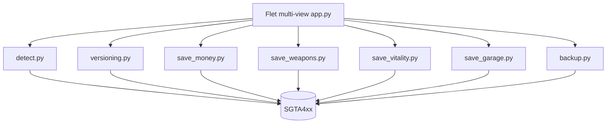

# App overview

Offline Windows editor for GTA IV **Complete Edition** Profiles (`SGTA4xx`). Edits **PlayerInfo** (money, weapons, vitality) and **Block 4 Garages** (safehouse parking). UI: Flet 1.0. Supported savegame dword: **57**. Dual-arch EXE via `flet pack`.



## Features

### Startup save gate

On every launch, pick a Rockstar Profile and `SGTA4xx` slot, then **Continue**. Last profile/slot/install are remembered in settings and pre-selected next time. The gate also auto-detects GTA IV installs across all drives (Steam / SteamLibrary / Rockstar / registry + `libraryfolders.vdf`), shows **version + modded state**, and lets you Browse to a folder. **Change save** is available from the home menu and Settings (not repeated in each editor).

### Home menu (radial wheel)

GTA-style selector: outer ring **Money**, **Weapons**, **Vitality**, **Garage**; **Settings** in the center. Window size snaps per view (user-non-resizable).

| Control | Opens |
|---------|--------|
| Money (1) | Set / add cash |
| Weapons (2) | 2x5 slot cards, picker, equipped slot |
| Vitality (3) | Health, armour, maxima |
| Garage (4) | Safehouse parked cars + spawn |
| Settings (5 / S) | Autobackup, also-autosave, Change save |

Keyboard: Tab moves focus; Enter activates; Esc returns to menu.

### Garage

Pick a safehouse (Broker, South Bohan, Middle Park East, Playboy X, Alderney). Occupied spots: change vehicle model or clear. Empty spots: **Spawn** into a free curated parking pose. Vehicle names come from the selected install's `vehicles.ide` merge order.

### Edit flow

1. Quit GTA IV completely.
2. Open 4Bucks, Confirm/Continue on the save gate.
3. Open a view - status chip shows slot, mission title, version, and eligibility.
4. Apply edits (Autobackup on by default; optional also-autosave `SGTA412`).
5. Load the save in-game.

### Weapons loadout

The picker shows the full IV/TLAD/TBoGT stock list. Mod weapons use the GTA IV install chosen on the save gate (weaponinfo + custom ID). Stock IDs are labeled **stock**; unknown IDs are **mod**.

### Autobackup

| Location | Pattern |
|----------|---------|
| Beside the save | `SGTA4xx.backup` |
| App folder | `backups/{profile}_{SGTA4xx}_{timestamp}_m{old}.backup` |

If either copy fails, the write is aborted.

### Safety gates

- Warns if `GTAIV.exe` is running.
- Version gate and PlayerInfo checks; techniques `PLAYERINFO_INPLACE_V57` and `GARAGES_INPLACE_V57` for dword 57.
- Dual Autobackup by default.

### Save locations (CE)

```text
%USERPROFILE%\OneDrive\Documents\Rockstar Games\GTA IV\Profiles\<ID>\
%USERPROFILE%\Documents\Rockstar Games\GTA IV\Profiles\<ID>\
```
