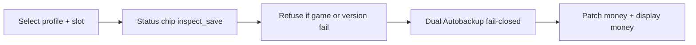

# Architecture

<a id="nav-architecture"></a>

## Module map

```text
UI (app.py - Flet / Flutter)
  → detect.py          find Profiles / list SGTA4 slots / game running?
  → versioning.py      SAVE magic, version allowlist, PlayerInfo gate
  → save_money.py      parse BLOCK / read+write money
  → backup.py          dual Autobackup
  → settings.py        persist Autobackup / also-autosave toggles
```



## Data flow

1. User selects profile + slot.
2. Status chip from `inspect_save` / `check_write`.
3. On Set/Add: refuse if game running or version gate fails.
4. Optional confirm for non-CE path warnings.
5. If Autobackup: copy to `{save}.backup` and `app/backups/...` (fail closed).
6. Patch money + display money uint32 LE; re-read verify.

## App directory

- Frozen EXE: folder containing `Save4Bucks-x64.exe` / `Save4Bucks-x86.exe`
- Source: repo root (`4bucks/`)

Used for `backups/` and `save4bucks_settings.json`.
